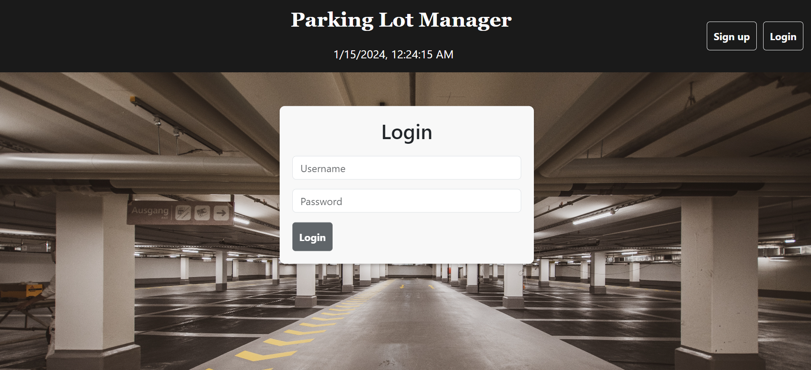
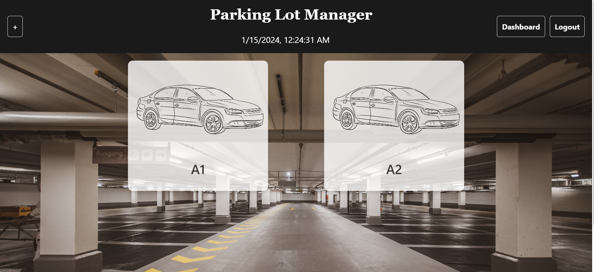
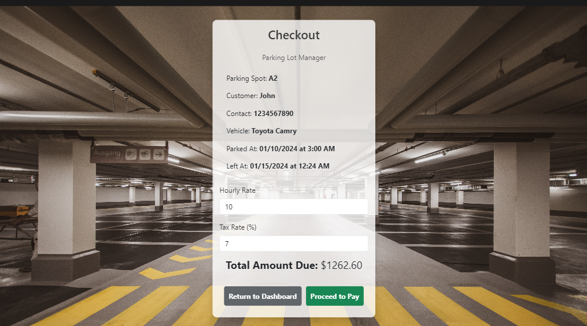
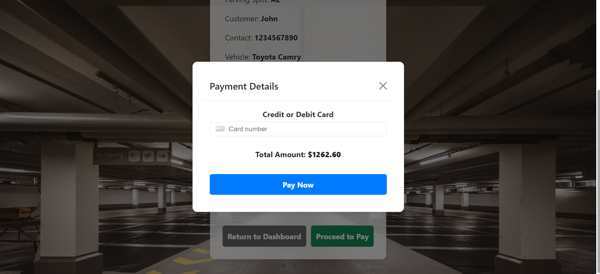

# Parking_lot_Manager

## Description 
Description
The Parking Lot Manager is a web application that simplifies parking space management. It allows users to create profiles, log in, manage parking spaces, add customer and car information, calculate parking fees, and facilitate payments through card transactions.

Features
User Profiles: Users can create profiles and log in to access the parking management features.

Parking Space Management: Users can create and manage parking spaces, making it easy to keep track of availability.

Customer and Car Information: Users can add customer information and car details to each parking space for better organization.

Payment Calculation: The application automatically calculates the total parking fee based on parked at and left at times.

Secure Card Payments: Users can make payments securely through card transactions.

 ## Technologies Used.
  1. Front-end: React
     used React for building the user interface of the application.
  2. Back-end:
      GraphQL API
      Node.js and Express.js server
      MongoDB and Mongoose ODM for the database  
  3. Database: MongoDB (with Mongoose ODM)
     the application utilized MongoDB as the database management system, and used Mongoose ODM to interact with the database.
  4.  User Authentication: JWT (JSON Web Tokens)
      Authentication in the application was implemented using JWT to secure user sessions. 
  5.  Payment Platform:
      integrated the Stripe payment platform.

  ## Usage
 when the user run the page it will ask to login or sign up.
 then the user will be able to add parking spaces.
 then the user will be able to get customer and car info to.
 then the page will calculate the total payment required.
 then the user will let the customer pay.

## Installation.
1. Clone the Repository: Clone the repository to your local machine.
2. run npm install
3. run npm run seed
4. run npm run develop
 
 ## Screenshots.

## Authors and acknowledgment:
Developers:
Mahmoud Abdelgawad (https://github.com/Nabil1294)

### Deployed Page Link:

### Heroku Link:

